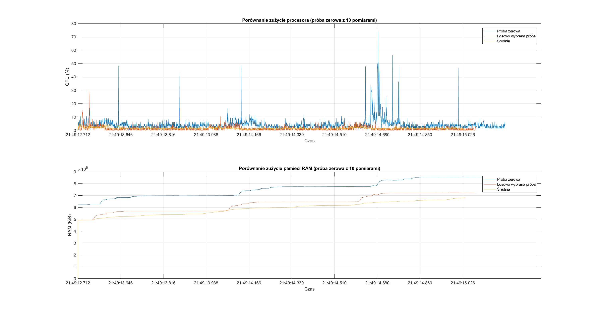
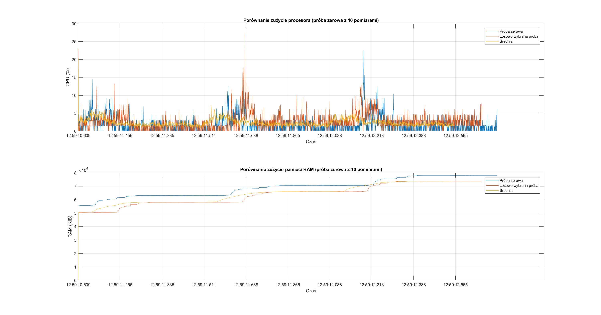
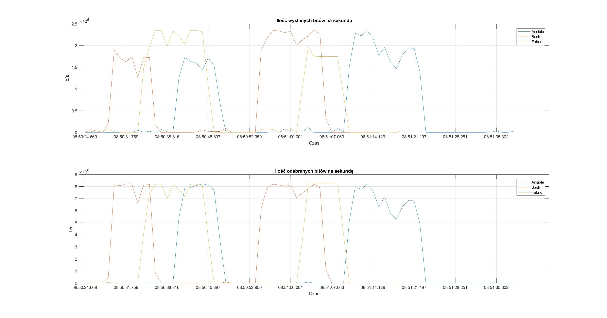
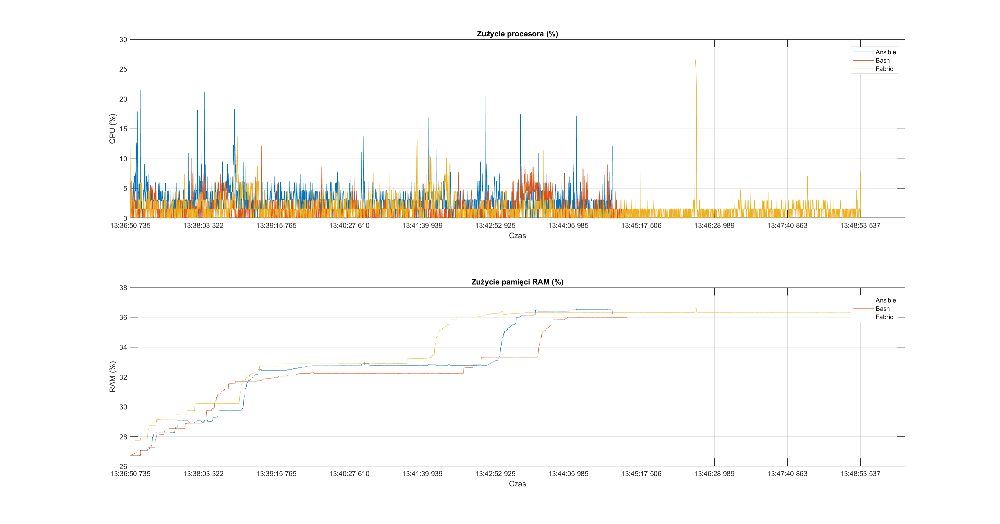

# Comparative analysis of infrastructure provisioning tool based on web application - data repo.

This is my master degree project. 
Repository includes all provisioning tools code and benchmarks prepared for them.
  
## File structure 

```
.
├── ...
├── data_for_master_degree                                # Repository folder
│   ├── bash                                              # Tool used for research
│   │   ├── static                                        # Application used for research
│   │   │   ├── single                                    # Deployment type used for research
│   │   │   │   ├── 0                                     # index of reserch attempt
│   │   │   │   │   ├── deploy_time.txt                   # File with deployment time and start date
│   │   │   │   │   ├── net-bash-grafana-2022-08-03.log   # Readings from network interface
│   │   │   │   │   └── ps-bash-grafana-2022-08-03.log    # Readings from CPU and RAM usage
│   │   │   │   ├── 1
│   │   │   │   │   └── ...
│   │   │   │   └── N
│   │   │   │       └── ...
│   │   │   └── multi
│   │   ├── grafana         
│   │   │   ├── single
│   │   │   └── ...
│   │   └── tiquet
│   │       ├── single
│   │       └── ...
│
└── ...
```

```bash
# structure
./data_for_master_degree
        /bash/grafana/multi/0/

# example
./data_for_master_degree/bash/grafana/multi/0/
```


## Matlab
main file - figures.m

## Python
main file - main.py

## Readings (Charts example)
Static - Multi
 
### Usage

#### CPU Usage


#### RAM Usage in %


#### RAM Usage in Kib


#### CPU and RAM %


### NET

#### NET TBPS and RBPS split


### TIME

#### TIME in seconds


#### TIME in minutes


### Zero Random Avrage

#### Ansible


#### Bash



#### Fabric



```

############################################################################################
############################################################################################
                                        
############################################################################################
############################################################################################

```

## All of readings
### Static single


### Static multi


### Grafana single




### Grafana split


### Grafana multi


### Tiquet single


### Tiquet split



### Tiquet multi


